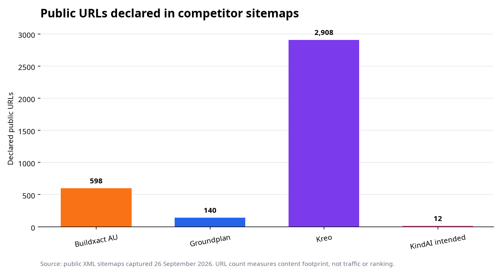
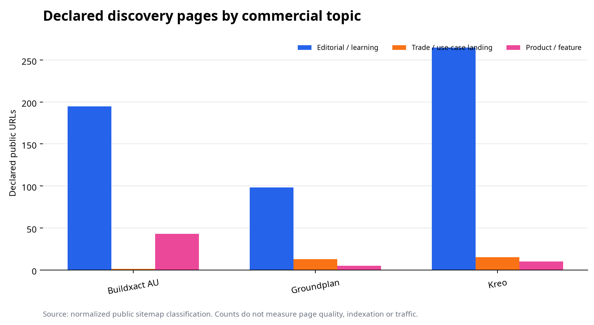
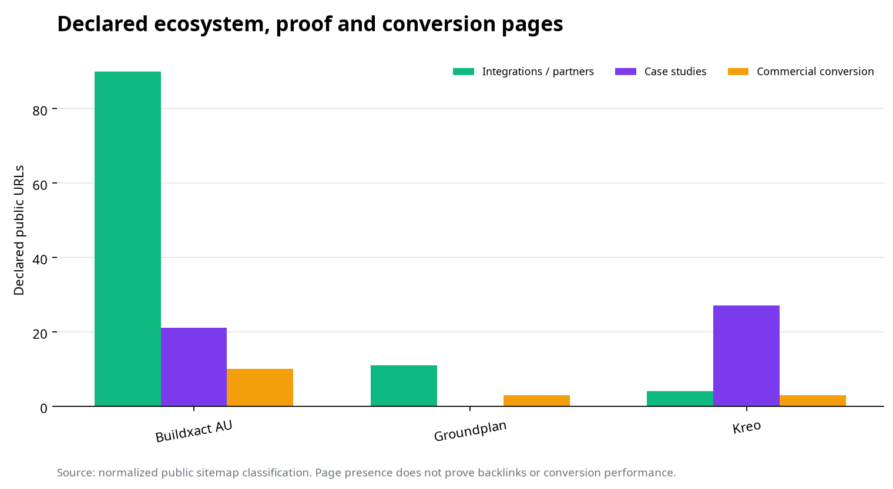

# SEO Competitor Report: Buildxact AU, Groundplan and Kreo

**Prepared by:** Manus AI  
**Date:** 26 September 2026  
**Primary data sources:** Public XML sitemaps and robots files  
**Unavailable sources:** Ahrefs, Similarweb, Search Console and GA4

## Executive Narrative

**The visible competitive gap is content surface, not proven traffic.** Buildxact AU declares 598 public URLs, Groundplan 140 and Kreo 2,908, while KindAI's corrected local sitemap declares 12.[1] The data cannot confirm rankings, traffic or conversion. It does show three different search strategies: Buildxact spreads coverage across editorial content, integrations, partners and case studies; Groundplan concentrates on practical trade education and trade-specific estimating pages; Kreo operates a glossary-heavy publishing system supported by product, use-case and comparison pages.[2]

Each competitor has created more search entry points than KindAI, but the dependency differs. Buildxact has the most balanced discoverable estate. Groundplan depends heavily on its 95-page editorial library, which accounts for 67.9% of declared URLs. Kreo depends overwhelmingly on 2,539 glossary and definition pages, about 87% of its sitemap. For an observer, raw volume is therefore misleading: Buildxact's partner and integration network signals commercial ecosystem depth, Groundplan's structure signals Australian trade education, and Kreo's scale is largely a programmatic glossary moat rather than 2,908 distinct commercial pages.[2]

---

# Part 1: Organic Search Footprint

## 1. Business Context and SEO Footprint

**Buildxact AU has the broadest balanced footprint; Kreo has the largest total footprint; Groundplan has the clearest trade-education concentration.**

| Domain | Declared public URLs | Dominant visible pattern | Evidence limitation |
|---|---:|---|---|
| Buildxact AU | 598 | Editorial, partner, integration, case-study and product pages | No traffic or ranking weights |
| Groundplan | 140 | Editorial guides plus trade-specific estimating pages | No traffic or ranking weights |
| Kreo | 2,908 | Glossary network plus AI takeoff editorial content | Glossary scale dominates the total |
| KindAI intended | 12 | Core commercial and support pages | Local sitemap is not yet live |

The sitemap count measures pages declared for discovery. It does not measure indexation, quality, authority or demand.[1]

## 2. Page Type Analysis: Where Organic Demand Could Land

**Buildxact exposes multiple commercial pathways, while Groundplan and Kreo are more dependent on publishing systems.** Buildxact declares 195 editorial pages, 90 integration or partner pages, 43 product or feature pages and 21 case studies.[2][3] This produces several routes from research intent into commercial evaluation and reflects an ecosystem strategy rather than a single keyword cluster.

Groundplan declares 95 editorial pages, 13 trade or use-case landing pages and 11 integration or partner pages.[2][4] Visible URLs cover electrical, plumbing, HVAC, concrete, painting, roofing and other estimating use cases, along with Xero, ServiceM8, Simpro, AroFlo and related integrations.[4] Its organic surface is closely tied to the operating language of Australian trade businesses.

Kreo declares 2,539 glossary and definition pages, 261 editorial pages, 27 case studies, 21 trade or use-case pages and a small comparison section.[2][5] This is the largest footprint but also the most concentrated: glossary pages account for the overwhelming majority of declared URLs.

## 3. Organic Visibility by Country

**Country visibility is unverified.** The public sitemap establishes an Australian subdirectory for Buildxact and Australian market relevance for Groundplan, but it does not quantify country traffic. Kreo uses a global `www.kreo.net` structure. No country traffic or keyword dataset was available.[6]

## 4. Traffic Trend: Is Organic Search Growing or Declining?

**No defensible trend can be stated.** Similarweb data calls returned HTTP 401, and no Search Console, GA4, Ahrefs or Semrush trend export was available. Sitemap `lastmod` values prove page updates, not traffic growth.

## 5. Branded vs Non-Branded Search

**The page architecture targets non-branded discovery, but the click split is unknown.** Groundplan's trade pages and practical guides, Kreo's glossary and takeoff education, and Buildxact's product, partner and integration estate all create non-branded entry points.[2] Without keyword and click data, the available evidence cannot show whether this breadth produces meaningful non-branded traffic.

---

# Part 2: Backlink Strategy Evidence

## 6. Backlinks: How Are the Competitors Building Links?

**Backlink profiles are unverified, but Buildxact's public architecture contains the clearest relationship-led link surface.** Buildxact declares 90 integration or partner URLs and 21 case-study URLs; Groundplan declares 11 integration or partner URLs and one classified case-study route; Kreo declares 27 case-study URLs and six integration or partner routes.[2] These pages can support co-marketing, customer citation and ecosystem links, but the sitemap cannot prove that links exist.

Ahrefs calls returned an “Insufficient plan” response. Anchor text, referring-domain quality, three-month link growth and competitor link gaps therefore remain unavailable. No backlink conclusion is presented.

---

# Part 3: Strategic Assessment

## 7. Key Dependencies and Vulnerabilities

**Buildxact depends on breadth, Groundplan on a concentrated editorial and trade-use-case library, and Kreo on glossary scale.**

Buildxact's footprint is comparatively diversified. Its discoverable estate does not rely on one folder alone, which reduces visible dependence on a single content format. Its vulnerability is maintenance complexity: hundreds of partner, product and editorial URLs require consistent regional metadata and current claims.[2][3]

Groundplan's public SEO estate is smaller and more coherent. About 68% of declared URLs are editorial, and trade-specific estimating pages form the clearest commercial cluster.[2][4] Its visible dependency is that a limited number of commercial pages must convert research traffic into product evaluation.

Kreo's scale is structurally concentrated. Approximately 87% of its declared URLs sit in the glossary network, while editorial, product, comparison and trade pages form a much smaller share.[2][5] This creates broad definitional coverage, but a competitor observing the estate would treat the 2,908-page headline with caution because page count and commercial search strength are not equivalent.

## Data Limitations

The standard chart generator could not create traffic, country, landing-page, branded/non-branded or backlink charts because the required datasets were absent.[6] The included custom chart uses normalized sitemap counts and explicitly measures content footprint only.

## References

[1]: tables/sitemap_footprint.csv "Normalized sitemap URL totals captured 26 September 2026"
[2]: tables/sitemap_content_mix.csv "Derived sitemap page-type classification"
[3]: competitors/buildxact-au-sitemap-index.xml "Buildxact AU public sitemap index"
[4]: competitors/groundplan-com-sitemap.xml "Groundplan public sitemap"
[5]: competitors/kreo-net-sitemap.xml "Kreo public sitemap"
[6]: charts/asset_manifest.md "Unavailable standard SEO chart inputs"
